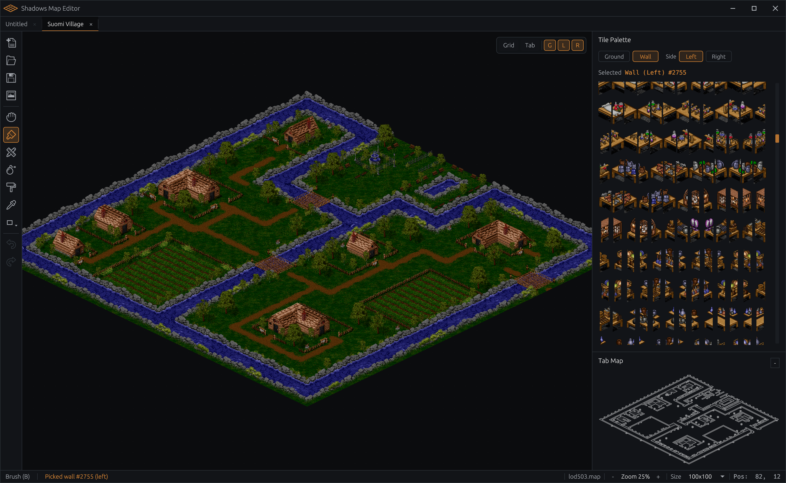

# Shadows Map Editor

Isometric map viewer and PNG exporter for Shadows of Temuair (Dark Ages) `.map` files.
Built with Rust and [egui](https://github.com/emilk/egui).

Supports both:
- Legacy single-palette rendering (`legend.pal`)
- Newer palette-table rendering (`mpt*` / `stc*` `.tbl` + `.pal`)

**This is a work in progress with map viewing, editing, and export support.**



## Requirements

- **Rust stable** (2024 Edition) — install via [rustup](https://rustup.rs/)
- macOS, Windows, or Linux with GPU support for egui/wgpu

## Building

```sh
cargo build --release
```

The binary is output to `target/release/map-editor`.

## Assets

The editor loads game assets from `.dat` archive files in an `assets/` directory at the working directory root. These archives are not included in the repository — you must supply them from your own copy of the game.

**Required files** (inside the `.dat` archives):

| File | Purpose |
|------|---------|
| `TILEA.BMP` | Ground tile sprite sheet (56x27 px tiles) |
| `stcNNNNN.hpf` | Wall/object sprites (Huffman-compressed, 28px wide) |
| `SOTP.DAT` | Tile collision/passability data — **required for tab map rendering and export** |

**Palette assets (one of these modes, auto-detected):**

| Mode | Files |
|------|-------|
| Legacy | `legend.pal` |
| Palette-table (newer clients) | Ground: `mpt*.tbl` + `mpt*.pal`<br>Walls: `stc*.tbl` + `stc*.pal` |

When palette-table assets are present, the editor uses them. If they are missing, it falls back to legacy `legend.pal` rendering. Mixed asset sets are also supported (for example, palette-table ground with legacy walls).

Without `SOTP.DAT`, the tab map preview in the inspector panel and tab map PNG export will be unavailable. Without the tile/wall assets, maps will open but tiles will not render.

Place your `.dat` archive files in the `assets/` directory:

```
shadows-map-editor/
  assets/
    ARCHIVE1.DAT
    ARCHIVE2.DAT
    ...
```

Archives are loaded alphabetically. If multiple archives contain the same filename, the last one (alphabetically) wins.

## Prefabs

Prefab definitions live in `prefabs/` at the project root, alongside `assets/`.
Each prefab is stored as a `.ron` file and can be edited in its own tab (`prefab: ...`) using the same tile/wall tools as normal maps.

Empty prefab cells are transparent when placed:
- `ground = 0` does not overwrite map ground
- `left_wall = 0` does not overwrite the destination left wall
- `right_wall = 0` does not overwrite the destination right wall

## Usage

Run from the project root (so the `assets/` directory is found):

```sh
cargo run --release
```

### Opening Documents

- **Cmd+O** — Open a `.map` file via file dialog
- **Drag and drop** — Drop `.map` or `.ron` files directly onto the window to open them
- **Cmd+N** — Open the New Map size dialog and create a new map
- **Cmd+W** — Close the active tab

If `maps.ron` exists in the project root, the editor uses it as map metadata:
- matches the map number from the filename (e.g. `LOD185.MAP` → `185`)
- applies the listed map name as the tab title
- applies the listed dimensions when `width * height` matches the file tile count

### Viewport

- **Scroll wheel** — Zoom in/out
- **Cmd+Plus / Cmd+Minus** — Zoom in/out (snaps to 25% increments)
- **Cmd+0** — Reset zoom to 100%
- **Middle mouse drag** — Pan the viewport

### Layer Visibility

- **Cmd+1** — Toggle ground tiles
- **Cmd+2** — Toggle left walls
- **Cmd+3** — Toggle right walls
- **Cmd+4** — Toggle grid overlay
- **Tab** — Toggle tab collision overlay on the main viewport (requires `SOTP.DAT`)
- The `Tab` overlay toggle affects only the main map viewport (not the inspector tab map or tab map PNG export).
- Floating viewport controls include `Grid` and `Tab` toggles in the top-right.
- The inspector bottom panel shows the map's `Tab Map` normally, and switches to a collapsible `Prefab Preview` while the Prefab tool is active.

### Editing

- **B** — Switch to Brush tool
- **L** — Switch to Line tool
- **P** — Switch to Prefab tool
- **E** — Switch to Eraser tool
- **G** — Switch to Fill tool
- **I** — Switch to Eyedropper tool
- **U** — Switch to Shape tool
- **T** — Toggle tile paint layer between Ground and Wall (preserves the current wall side)
- **Q** — Toggle wall paint target side (Left/Right) while in Wall mode
- **Left click (Brush)** — Paint the hovered tile
- **Left drag (Brush)** — Paint continuously while holding the mouse button
- **Shift+Left click (Brush)** — Draw a line from the last brush click to the clicked tile (does nothing if there is no previous brush click)
- **Left click (Line)** — First click sets the line start, next click paints a line to that point (live preview shown while hovering)
- **Left click (Shape)** — First click sets shape start, next click draws outline to that point (live preview shown while hovering)
- **Shape dropdown (toolbar)** — Choose `Rect`, `Square`, `Circle`, or `Triangle` (last selected shape icon is shown on the button)
- **Esc** or **Right click (Line/Shape)** — Cancel the pending start point
- **Left click/drag (Eraser)** — Clear ground tiles (writes tile ID `0`)
- **Left click (Fill)** — Flood-fill contiguous ground region with the selected ground tile
- **Prefab tool** — Uses the selected prefab from the inspector's `Prefab Library`
- **Left click (Prefab)** — Place the selected prefab at the hovered tile origin with live translucent preview
- **Left click (Eyedropper)** — Pick the hovered value for the active palette mode (ground in Ground mode, left wall in Wall mode)
- **Shift+Left click (Eyedropper)** — In Wall mode, pick the hovered right wall instead of left wall
- **Eyedropper hover highlight** — Shows exactly which ground/wall target will be sampled before clicking
- **Alt/Option (hold)** — Temporarily use Eyedropper while held (supports the same Shift behavior)
- **Prefab tool inspector** — Replaces the tile palette with the prefab browser
- **Search prefabs** — Filters the prefab list by partial filename match as you type
- **Prefab list rows** — Show the prefab file stem and the occupied dimensions, not the full canvas size
- **New** — Create a new prefab tab
- **Import** — Pick a `.ron` prefab file and copy it into the local `prefabs/` registry
- **Prefab Preview** — The inspector bottom panel shows a rendered ground+wall preview of the selected prefab, scaled to fit

### Export

- **Cmd+E** — Open the export dialog
- Exports the map as a PNG at configurable scale (25%–400%)
- Optional solid background color (transparent by default)
- Optional tab map export (collision wireframe) as a separate `_tab.png` file with its own scale and background settings

### Map Dimensions

The status bar shows the current map dimensions. Click the dimension label to choose from all valid factor pairs for the tile count — useful for maps where the original width/height is ambiguous.
The size menu also includes **Custom Size...** to enter explicit `width x height` values (each from `1` to `65535`).
When reducing total tile count in **Custom Size...**, the dialog shows a warning that data will be truncated.

### Status Bar

The active file name is shown in the status bar next to zoom controls so it is always visible without hovering tabs.

## Project Structure

```
├── archive/    # .dat archive memory-mapped loader
├── map/        # Map data structures and tile format
├── prefabs/    # Prefab `.ron` files used by the editor prefab tool
├── render/     # Palette, tile atlas, sprite atlas, HPF decoder
└── editor/     # egui application, UI panels, PNG export
```

## Map Format

Each `.map` file is raw binary — 6 bytes per tile (three little-endian `u16` values: ground ID, left wall ID, right wall ID). The editor infers map dimensions from the tile count.

## Prefab Format

Each `.ron` prefab stores `width`, `height`, and a flat `tiles` array. Tile fields are optional in RON and only non-zero layers are placed onto destination maps.
